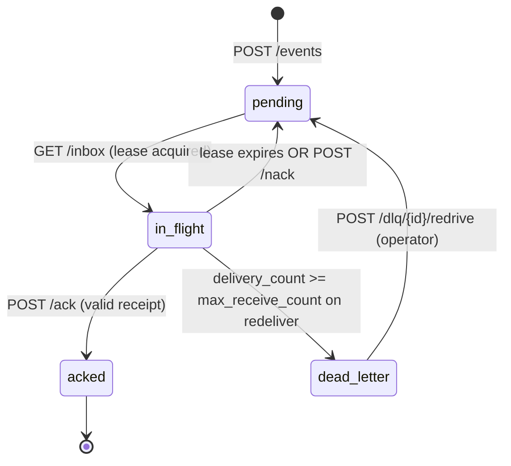

# TriggersAPI — Product Requirements & Technical Design

> Status: Design (v1 prototype). Author-driven design doc; the build deliberately
> implements a subset. See `DECISIONS.md` for the scope cut line and rationale.

## 1. Summary

TriggersAPI is a public, RESTful ingress for events: any external system can `POST`
an event, and consumers (workflows, agents, other systems) can pull those events to
"wake up" and react. It is the *reacting* counterpart to Zapier's Action Runs API
(*acting*). The contract is a **reliable, at-least-once event queue with an HTTP
front door** — modeled on the SQS receive/visibility-timeout/ack pattern, not a
naive store-and-list inbox.

The design below is intentionally broad. The v1 prototype builds a clean, correct
core of it; every deferred capability is enumerated with a reason in `DECISIONS.md`.

## 2. Goals / Non-Goals

**Goals**
- Accept events from arbitrary producers over HTTP with a stable, versioned contract.
- Deliver each event to a consumer **at least once**, with visibility of delivery state.
- Survive consumer crashes without losing events (lease expiry → redelivery).
- Quarantine poison events (dead-letter after N attempts) so one bad event can't stall a consumer.
- Make correctness legible: predictable status codes, a `problem+json` error shape, an event state machine a reader can hold in their head.

**Non-Goals (v1)**
- Exactly-once delivery (impossible without consumer-side idempotency; we push that responsibility to consumers and make it cheap — see §5.3).
- Multi-tenant topic/subscription fan-out. v1 is a single logical queue with competing consumers.
- Durable cross-restart storage. v1 is in-memory behind an interface; durability is a swap, not a rewrite (§8).
- Push delivery (webhooks out / WebSockets / SSE). v1 is pull with optional long-poll (§5.5).
- Horizontal scale / partitioning. Designed for, not built (§13).

## 3. Personas & primary flows

| Persona | Need | Flow |
|---|---|---|
| **Producer** (SaaS, IoT, internal service) | Emit an event and get durable acknowledgment | `POST /v1/events` → `201` with server-assigned id + status |
| **Consumer** (workflow / agent) | Wake up on new events, process, confirm | `GET /v1/inbox` (leases a batch) → work → `POST /v1/events/{id}/ack` |
| **Operator** | See depth, redelivery rate, poison events | `GET /v1/dlq`, `GET /metrics`, `GET /v1/events/{id}` |

## 4. Domain model & event lifecycle

**Event** = a server-assigned envelope wrapping an opaque producer payload.

```
Event {
  id:            ULID          # server-assigned, lexicographically sortable by time
  status:        pending | in_flight | acked | dead_letter
  payload:       object        # opaque JSON, validated only for size/shape, not semantics
  source:        string?       # producer-declared origin
  event_type:    string?       # producer-declared type, for consumer routing
  idempotency_key: string?     # producer-supplied; dedup within a window
  received_at:   timestamp     # server clock (authoritative)
  event_time:    timestamp?    # producer clock (informational)
  delivery_count: int          # number of times leased out
  lease:         { receipt: ULID, expires_at: timestamp } | null
  last_error:    string?       # why it was nacked/dead-lettered
}
```

**Lifecycle (state machine):**



The invariant that makes this correct: **an event in `in_flight` is invisible to
other `GET /inbox` calls until its lease expires or it is acked/nacked.** Everything
in §5 and §9 exists to protect that invariant.

## 5. Delivery semantics (the crux)

### 5.1 At-least-once
We guarantee delivery *at least* once. A consumer that receives an event but crashes
before acking will see it again after the lease expires. Duplicates are possible and
expected; §5.3 makes them cheap to absorb.

### 5.2 Visibility timeout (lease) vs delete-on-read
`GET /inbox` does **not** delete events; it leases them for `visibility_timeout`
seconds and returns a `receipt`. Delete-on-read would lose events on consumer crash
(at-most-once). Lease + ack is the only model that survives crashes without a
distributed transaction. This is the single most important design choice — see
`DECISIONS.md` ADR-002.

### 5.3 Idempotency & deduplication
- **Producer-side (ingest dedup):** if a producer supplies `idempotency_key`, a repeat
  within the dedup window returns the *original* event (`200`, not `201`) instead of
  creating a duplicate. Protects against the classic "client timed out and retried the
  POST but the first one actually succeeded" case.
- **Consumer-side (delivery dedup):** every delivered event carries a stable `id` and
  `delivery_count`. Consumers dedupe on `id`. We document this contract loudly so
  "at-least-once" doesn't surprise anyone.

### 5.4 Ordering
Best-effort FIFO by `received_at` (ULID sort). We do **not** promise strict global
order: redelivery, competing consumers, and lease expiry all reorder. An optional
`ordering_key` is designed (events with the same key are never leased concurrently) but
deferred from the build — see the cut table.

### 5.5 Retry, backoff, and dead-letter
- On lease expiry or explicit `nack`, the event returns to `pending` and is redelivered.
- Redelivery uses a **visibility backoff**: nth redelivery is invisible for
  `min(base * 2^(n-1), cap)` seconds, so a consumer that's failing fast doesn't hot-loop.
- After `delivery_count >= max_receive_count`, the event moves to `dead_letter` and is
  no longer delivered. Operators inspect `GET /v1/dlq` and can `redrive`.

### 5.6 Polling model
`GET /inbox` supports short-poll (return immediately, possibly empty) and optional
**long-poll** (`wait=Ns`: hold the connection until an event is available or the timeout
elapses). Long-poll simulates the "wake-up" semantics cheaply without push infrastructure.

## 6. API specification

**Conventions:** base path `/v1`; JSON only; errors use `application/problem+json`
(RFC 7807); IDs are ULIDs; timestamps are RFC 3339 UTC; list endpoints paginate with
an opaque `cursor`. OpenAPI is auto-generated (FastAPI) and served at `/docs`.

| Method | Route | Purpose | Success |
|---|---|---|---|
| `POST` | `/v1/events` | Ingest an event | `201 Created` (or `200` on idempotent replay) |
| `GET`  | `/v1/inbox?limit=&wait=` | Lease a batch of pending events | `200 OK` |
| `POST` | `/v1/events/{id}/ack` | Confirm processing (needs `receipt`) | `204 No Content` |
| `POST` | `/v1/events/{id}/nack` | Return early for redelivery (needs `receipt`) | `204 No Content` |
| `POST` | `/v1/events/{id}/extend` | Extend an in-flight lease | `200 OK` |
| `GET`  | `/v1/events/{id}` | Inspect any event (state, delivery_count) | `200 OK` |
| `GET`  | `/v1/dlq` | List dead-lettered events | `200 OK` |
| `POST` | `/v1/dlq/{id}/redrive` | Return a DLQ event to pending | `200 OK` |
| `GET`  | `/healthz` | Liveness | `200 OK` |
| `GET`  | `/metrics` | Operational counters | `200 OK` |

**`POST /v1/events`** — request:
```json
{ "event_type": "order.created", "source": "shop-api",
  "idempotency_key": "ord_9931", "event_time": "2026-08-06T12:00:00Z",
  "payload": { "order_id": 9931, "total": 42.00 } }
```
response `201`:
```json
{ "id": "01J...", "status": "pending", "received_at": "2026-08-06T12:00:01Z",
  "delivery_count": 0 }
```

**`GET /v1/inbox?limit=10&wait=20`** — response `200`:
```json
{ "events": [ { "id": "01J...", "event_type": "order.created",
    "payload": {...}, "delivery_count": 1,
    "receipt": "01K...", "lease_expires_at": "2026-08-06T12:00:31Z" } ],
  "count": 1 }
```
The `receipt` is required to ack/nack — it proves the caller holds the current lease and
rejects a stale ack from a previous delivery (§9).

**Error shape (`problem+json`):**
```json
{ "type": "/errors/lease-expired", "title": "Lease expired",
  "status": 409, "detail": "Receipt 01K... is no longer valid for event 01J...",
  "instance": "/v1/events/01J.../ack" }
```

## 7. Edge case catalog

The staff artifact. Each row is a boundary condition; the "v1" column is what the
prototype does; "deferred" rows are justified in `DECISIONS.md`.

### 7.1 Ingestion
| Edge case | v1 behavior | In build? |
|---|---|---|
| Malformed / non-JSON body | `400 problem+json`, no event stored | ✅ |
| Payload exceeds size limit (e.g. 256 KB) | `413 Payload Too Large` | ✅ |
| Missing `payload` | `422` (envelope requires a payload object) | ✅ |
| Unknown top-level fields | Accepted and ignored (forward-compatible) | ✅ |
| Duplicate `idempotency_key` in window | Return original event, `200` | ✅ |
| Duplicate `idempotency_key` after window | New event (window is bounded to cap memory) | ✅ |
| No `idempotency_key` | Always creates a new event | ✅ |
| Producer clock skew (`event_time` in future/past) | Stored as-is; server `received_at` is authoritative | ✅ |
| Burst / overload | `429` with `Retry-After` (token bucket) | ⛔ deferred (documented) |
| Unauthenticated producer | `401`; HMAC signature verification | ⛔ deferred (documented) |

### 7.2 Delivery / consumption
| Edge case | v1 behavior | In build? |
|---|---|---|
| Empty inbox, short-poll | `200` with `events: []` | ✅ |
| Empty inbox, long-poll `wait=N` | Hold up to N s, then `[]` | ✅ |
| Two consumers poll simultaneously | Atomic lease; each event goes to exactly one (§9) | ✅ |
| Consumer crashes before ack | Lease expires → event redelivered, `delivery_count++` | ✅ |
| Consumer processes then crashes before ack | Duplicate delivery; consumer dedupes on `id` (§5.3) | ✅ (contract) |
| Ack with stale receipt (from a prior lease) | `409 lease-expired`, ack rejected | ✅ |
| Ack an already-acked event | Idempotent `204` (terminal state, no-op) | ✅ |
| Ack an event never leased | `409` (no active lease) | ✅ |
| Nack → immediate redelivery with backoff | `204`, event returns to pending with backoff | ✅ |
| Lease about to expire on a slow consumer | `extend` pushes `lease_expires_at` out | ✅ |
| Poison event (fails every consumer) | Dead-lettered after `max_receive_count` | ✅ |
| DLQ event needs reprocessing after a fix | Operator `redrive` → pending | ✅ |
| `ordering_key` events must not run concurrently | Designed; only one key in flight at a time | ⛔ deferred (documented) |
| Consumer wants only `event_type=X` | Designed (server-side filter on inbox) | ⛔ deferred (documented) |

### 7.3 System / correctness
| Edge case | v1 behavior | In build? |
|---|---|---|
| Process restart | In-memory store lost; documented limitation, interface allows durable swap | ✅ (documented) |
| Concurrent ack + lease-expiry race | Compare-and-set on lease receipt; expiry loses to a valid ack | ✅ |
| Unbounded memory from acked events | Acked events reaped after retention; DLQ retained longer | ✅ |
| Unbounded idempotency map | Dedup entries TTL out of the window | ✅ |
| Clock source for leases | Single server clock; monotonic where available | ✅ |
| Multi-instance deployment | Requires shared store + atomic conditional writes | ⛔ deferred → §13 |

## 8. Data model & persistence

v1 stores events in-process behind an `EventStore` interface:

```
EventStore:
  add(event) -> Event | existing (idempotent)
  lease(limit, now, visibility_timeout) -> [Event]     # atomic
  ack(id, receipt, now) -> Result
  nack(id, receipt, now) -> Result
  extend(id, receipt, now, extra) -> Result
  get(id) -> Event | None
  sweep(now) -> None       # expire leases, dead-letter, reap
  dlq() -> [Event]
```

The interface is the durability seam. **Production target: DynamoDB single-table**, using
**conditional writes** for atomic lease acquisition and ack (the same compare-and-set the
in-memory store does with a lock), a **TTL attribute** for idempotency-window and
acked-event reaping, and a GSI on `status` for the inbox scan. Postgres (`SELECT ... FOR
UPDATE SKIP LOCKED`) is the alternative and is noted in `DECISIONS.md` ADR-005.

## 9. Concurrency & correctness

Two properties must hold under concurrent access:

1. **No double-delivery within a lease.** `lease()` is a critical section: it selects
   `pending` (and lease-expired) events and flips them to `in_flight` with a fresh
   receipt atomically. In-memory: a lock. In DynamoDB: a conditional update that fails
   if another writer already leased the item.
2. **Ack authenticity.** `ack(id, receipt)` succeeds only if `receipt` equals the
   *current* lease receipt. This defeats the "consumer A's slow ack lands after the lease
   expired and consumer B re-leased it" bug — A's stale receipt is rejected (`409`),
   B still owns the event.

The lease-expiry sweep and a valid ack can race; ack wins via the compare-and-set, so an
event is never simultaneously acked and redelivered.

## 10. Non-functional requirements

- **Latency:** ingest and inbox p99 < 50 ms in-memory (excluding long-poll wait).
- **Payload limit:** 256 KB/event (configurable).
- **Durability posture (v1):** none across restart — explicit, documented prototype limit.
- **Throughput:** single-instance, single-lock; scale story is §13.
- **Backpressure:** designed (429 + token bucket), deferred from build.

## 11. Security

Designed, mostly deferred from the prototype build (documented in the cut table):
- **Producer auth:** HMAC-SHA256 signature over the raw body with a per-producer secret
  (`X-Signature` header) — standard webhook-ingress pattern, resistant to replay when
  combined with a signed timestamp. API key is the simpler fallback.
- **Consumer auth:** bearer token / API key scoped to the queue.
- **Payload limits & content-type pinning** guard against resource-exhaustion.
- **Multi-tenancy / per-tenant isolation:** out of scope for v1; noted as the first thing
  that changes the data model at scale.

## 12. Observability

- **Metrics** (`/metrics`): `events_ingested_total`, `inbox_depth` (pending),
  `in_flight_gauge`, `redelivery_total`, `dlq_depth`, `oldest_pending_age_seconds`.
  The last two are the ones an on-call actually pages on.
- **Structured logs** with a per-request id; log every state transition at debug.
- **Tracing:** designed (propagate `traceparent`), deferred.

## 13. Production architecture (AWS)

```
Producers ──HTTPS──> API Gateway ──> FastAPI (ECS Fargate or Lambda)
                                          │
                                          ▼
                                     DynamoDB (single table)
                                     - conditional writes = atomic lease/ack
                                     - TTL = dedup + reaping
                                     - Streams ──> long-poll wakeups / DLQ alarms
Consumers ──HTTPS──> API Gateway ──> same FastAPI
```

**Build vs buy:** SQS already *is* this (visibility timeout, DLQ, at-least-once). The
value of TriggersAPI is the **public HTTP contract, developer experience, and
event-model** on top — not reinventing the broker. A credible production version could
back the API with SQS + a thin metadata table rather than hand-rolling the queue. This
framing (know when not to build the hard part) is called out in `DECISIONS.md`.

## 14. Testing strategy

The test suite is the correctness proof and doubles as documentation:
- ingest happy path + idempotent replay returns the same id
- lease removes an event from a second poller's view
- ack removes it permanently; ack with stale receipt is rejected
- lease expiry redelivers and increments `delivery_count`
- `max_receive_count` exceeded → dead_letter, no further delivery
- long-poll returns as soon as an event is ingested
- concurrent pollers never receive the same event (race test)
```
